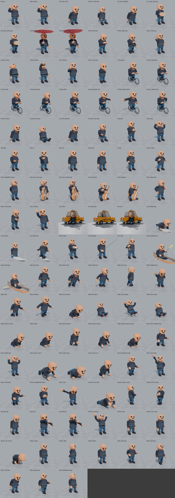
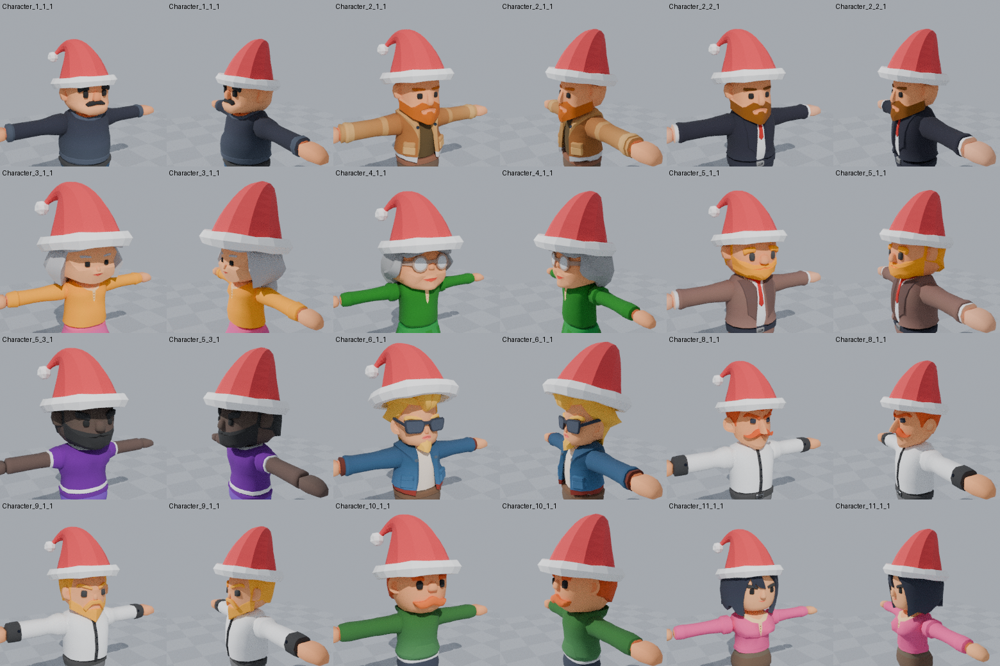

# Cartoon model rigging

`Characters_1_Godot/` is the Characters_1 pack for Godot 4 (308 characters sharing one
21-bone skeleton). The original zip is kept as `Characters_1_Godot.zip`.

This repo adds **99 new animations** to the pack's shared animation library, plus a few
props that go with them. All 47 original animations are untouched.



## New animations

All of them are in `Characters_1_Godot/Animations/Characters_1_Animations.glb`, so they work on
every character, the same way the original ones do. Names ending in `-loop` loop; Godot drops
that suffix on import (`Wave_B-loop` shows up as `Wave_B`).

| Group | Animations (Godot name) | Prop |
|---|---|---|
| Wave | `Wave_A` (raise, wave 3x, lower), `Wave_B` (loop) | |
| Sit on a chair | `Sit_Chair_Down`, `Sit_Chair_Idle`, `Sit_Chair_Talk`, `Sit_Chair_StandUp` | your own chair |
| Sit on the ground | `Sit_Floor_Down`, `Sit_Floor_Idle`, `Sit_Floor_StandUp` | |
| Carry a box | `Carry_Box_Idle`, `Carry_Box_Walk` | `Props/Box.glb` on `Torso` |
| Umbrella | `Umbrella_Idle`, `Umbrella_Walk` | `Props/Umbrella.glb` on `IteamSlot.R` |
| Look up | `LookUp_A` (scanning the sky), `LookUp_B` (shading the eyes) | |
| Phone | `Phone_Walk` (walking, looking down), `Phone_Idle` (texting), `Phone_Talk` (call at the ear) | `Props/Phone.glb` on `IteamSlot.R` |
| Hot | `Fan_Hot` (fanning the face, hand on hip) | |
| Cold | `Shiver_Cold` (hunched, shaking, rubbing hands) | |
| Cycling | `Cycling` (pedalling), `Cycling_Coast`, `Cycling_Stop` (brake, left foot down), `Cycling_Rest` (stopped, looking both ways), `Cycling_Start` (push off), `Cycling_Signal_Left` / `_Right` (arm out), `Cycling_Signal_Stop` (left arm bent down) | `Props/Bicycle.glb` at the character root |
| Cello | `Cello_Carry_Idle`, `Cello_Carry_Walk` (holding it by the neck), `Cello_Play` (seated, bowing), `Cello_Rest` (seated, bow down, swaying) | carrying: `Props/Cello_Carried.glb` on `IteamSlot.R`; playing: `Props/Cello_Played.glb` + `Props/Chair.glb` at the root, `Props/Bow.glb` on `IteamSlot.R` |
| Police | `Police_Radio` (keys the shoulder mic, talks, lets go to listen), `Police_Ticket` (writes a ticket, glancing up at the car) | `Props/Radio_Mic.glb` on `Torso`; `Props/TicketBook.glb` on `IteamSlot.L` + `Props/Pen.glb` on `IteamSlot.R` |
| Taxi | `Taxi_Hail` (arm up, watching the traffic), `Taxi_Enter`, `Taxi_Ride` (seated loop), `Taxi_Exit` | `Props/Taxi.glb` at the character root (enter/ride/exit) |
| Surfing | `Surf_Paddle` (lying on the board, paddling), `Surf_Sit` (astride the board, legs in the water, looking back for a wave), `Surf_Ride` (standing, carving one way then the other) | `Props/Surfboard.glb` at the character root |
| Kite | `Kite_Fly` (winder in both hands, small tugs, looking up at the kite) | `Props/Kite.glb` at the character root |
| Fishing | `Fish_Idle` (holding the rod, the odd twitch), `Fish_Cast` (back over the shoulder and out) | `Props/Rod.glb` on `IteamSlot.R` + `Props/Fishing_Line.glb` at the root |
| Canoe | `Canoe_Paddle` (a stroke on one side, then the other), `Canoe_Rest` (paddle across the knees, looking around) | `Props/Canoe.glb` at the character root (canoe and paddle) |
| Ice skating | `Skate_Idle` (balancing, the odd slip), `Skate_Stride` (pushing off one skate, then the other), `Skate_Glide` (coasting, curving one way then the other), `Skate_Spin` (a scratch spin on the left skate), `Skate_Wobble` (a beginner, arms windmilling), `Skate_Stop` (a snowplough stop, from `Skate_Glide` into `Skate_Idle`) | `Props/Skate_L.glb` on `Foot.L` + `Props/Skate_R.glb` on `Foot.R` |
| Falling on the ice | `Skate_Stumble` (catches a toe and recovers), `Skate_Fall_Forward` (onto hands and knees), `Skate_Fall_Back` (onto the bottom), `Skate_Fall_Wobble` (a beginner's wobble that ends on the bottom), `Skate_Sit_Ice`, `Skate_Kneel_Ice`, `Skate_GetUp`, `Skate_GetUp_Knees`, `Skate_GetUp_Clumsy`, `Skate_GetUp_Knees_Clumsy` | the skates, as above |
| Dances | `Dance_RunningMan`, `Dance_Robot` (stiff poses that snap on the beat), `Dance_Moonwalk`, `Dance_Disco` (the point up and down across), `Dance_Twist`, `Dance_CabbagePatch`, `Dance_Dab` (once), `Dance_Worm_Down` → `Dance_Worm` → `Dance_Worm_Up` | |
| Cheering someone up | `Sad_Idle` (slumped, head down, sighing), `Hug_Give` + `Hug_Receive` (a pair: step in, hug, hold at arm's length, step back) | |
| Stretches | `Stretch_Overhead` (arms up and out in a V, up on the toes), `Stretch_Side` (one arm up, bending to each side), `Stretch_Arm_Cross` (an arm pulled across the chest, each side), `Stretch_Toe_Touch` (folding forward to the toes), `Stretch_Quad` (standing on one leg, foot pulled up behind, each side), `Stretch_Back` (hands on the lower back, arching back, twisting), `Stretch_Neck` (head tilts, chin down, a neck roll, shoulder rolls) | |
| Zombie | `Zombie_Crawl` (belly on the floor, clawing forward one arm at a time, legs dragging) | |
| Walks | `Walk_Brisk`, `Walk_Stroll`, `Walk_Tired`, `Walk_Happy`, `Walk_Sightseeing` (looking up at the buildings), `Squeeze_Past_L` / `Squeeze_Past_R` (turned sideways, side-stepping between people in a crowd) | |
| Extras | `Talk`, `Clap`, `Cheer`, `Point_A`, `Nod_Yes`, `Shake_No`, `Shrug`, `Dance_A`, `Wait_HandsBehind` | |

The walking prop variants (`Carry_Box_Walk`, `Umbrella_Walk`, `Phone_Walk`, `Cello_Carry_Walk`)
are built on the pack's `Walk_C` cycle (1.03 s, in place), so they line up with it.

The `Walk_*` variants have their own cycle. Like the pack's walks they walk in place; move the
character at this speed so the planted foot doesn't slide:

| Walk | Cycle | Speed |
|---|---|---|
| `Walk_Brisk` | 0.8 s | 1.29 m/s |
| `Walk_Stroll` | 1.33 s (clip has 2 cycles) | 0.53 m/s |
| `Walk_Tired` | 1.47 s | 0.39 m/s |
| `Walk_Happy` | 0.87 s (clip has 2 cycles) | 0.96 m/s |
| `Walk_Sightseeing` | 1.13 s (clip has 4 cycles) | 0.68 m/s |
| `Squeeze_Past_L`, `Squeeze_Past_R` | 0.87 s (clip has 2 cycles) | 0.38 m/s |

`Squeeze_Past_L` and `Squeeze_Past_R` are for squeezing between people. The character turns about
80° sideways and shuffles along with side steps, leading with one foot and bringing the other in
after it. One hand is raised in front of the chest ("excuse me"), the other is held to the chest,
and once a loop they glance at the people in front and nod. The travel direction is still the
root's forward, so you can swap them in for a walk without turning the character: `_L` turns to
face the character's left, `_R` its right. Pick the side the people are on.

## Using the props in Godot

Bone props have their offset baked into the file, so you attach them with an identity transform:

```gdscript
var att := BoneAttachment3D.new()
att.bone_name = "IteamSlot.R"            # "Torso" for the box and radio mic, "IteamSlot.L" for the ticket book,
                                           # "Foot.L" / "Foot.R" for the skates
skeleton.add_child(att)                    # the character's Armature/Skeleton3D
att.add_child(preload("res://Characters_1_Godot/Props/Umbrella.glb").instantiate())
```

Root props (`Bicycle`, `Chair`, `Cello_Played`, `Taxi`, `Surfboard`, `Kite`, `Fishing_Line`, `Canoe`) are added as children of the character root
with an identity transform; their placement is baked in too.

The bicycle is a child of the character root (not a bone). Its own `AnimationPlayer` has one
animation per riding clip, the same length; start it together with the rider so the crank, wheels
and lean line up with the feet:

| Rider | Bicycle | |
|---|---|---|
| `Cycling` | `Pedal` | 0.8 s loop |
| `Cycling_Coast` | `Coast` | 2 s loop |
| `Cycling_Stop` | `Stop` | 1.5 s: brakes, wheels stop, the bike leans onto the left foot |
| `Cycling_Rest` | `Rest` | 3 s loop: stopped, leaning on the left foot |
| `Cycling_Start` | `Start` | 1.2 s: pushes off, the bike straightens, wheels speed up |

The clips chain without a seam: `Cycling_Coast` (from its first frame) -> `Cycling_Stop` ->
`Cycling_Rest` -> `Cycling_Start` -> `Cycling`. When stopped the rider stays on the saddle (their
legs are too short to stand over the bike) and the bike leans 18 degrees so the left toe reaches
the ground.

`Test/AnimationTest.tscn` attaches all of this automatically: pick an animation and the matching
prop appears.

**Police:** `Police_Radio` and `Police_Ticket` are made for the `PoliceMan_A`/`PoliceMan_B` models;
the radio mic is placed on their chest (beside the badge) and may float or sink on other body
shapes.

**Taxi:** `Props/Taxi.glb` is your PixelClock City `Taxi_5` (from `pixelclock-city-taxis.zip`),
scaled up 1.25x so the big-headed characters fit inside, with the right rear door cut out and
hinged, see-through windows and a simple cabin (floor, bench, front seat backs). Add it as a child of
the character root with an identity transform, like the bicycle, and play its door animation with
the character's clip:

| Character | Taxi | |
|---|---|---|
| `Taxi_Enter` | `Enter` | 5.5 s: opens the door by the handle, walks round it, hops up backwards onto the seat, swings the legs in, pulls the door shut, slides to the middle |
| `Taxi_Ride` | `Ride` | 4 s loop: seated, swaying with the car, looking out of the window |
| `Taxi_Exit` | `Exit` | 5.5 s: slides over, pushes the door open, hops down, closes the door from the kerb |

`Taxi_Enter` starts and `Taxi_Exit` ends in the idle stance on the kerb at the character root;
they chain through `Taxi_Ride`. To drive off, reparent the character to the taxi after
`Taxi_Enter` (or hide it). Very tall hair or hats (Character_B, the police caps) may brush the
roof while seated. `tools/taxi.py` does the fitting; change `TAXI_SCALE` or the door outline there.

**Water and beach:** the surfboard, kite, fishing line and canoe are root props with their own
`AnimationPlayer`, like the bicycle: play the animation named below together with the character's
clip (same length).

| Character | Prop | Prop animation | |
|---|---|---|---|
| `Surf_Paddle` | `Surfboard` | `Paddle` | 1.33 s loop |
| `Surf_Sit` | `Surfboard` | `Sit` | 5 s loop: the board rocks on the swell, nose up |
| `Surf_Ride` | `Surfboard` | `Ride` | 3 s loop: the board rolls into each turn |
| `Kite_Fly` | `Kite` | `Fly` | 4 s loop: the winder in the hands, the line and the kite (about 10 m up and out in front) |
| `Fish_Idle` | `Fishing_Line` | `Idle` | 5 s loop |
| `Fish_Cast` | `Fishing_Line` | `Cast` | 3.2 s: starts and ends on the `Fish_Idle` pose |
| `Canoe_Paddle` | `Canoe` | `Paddle` | 1.87 s loop: the canoe rocks with the strokes; the paddle is part of the prop |
| `Canoe_Rest` | `Canoe` | `Rest` | 5 s loop |

- For the surf and canoe clips the character root is on the **water surface**: the legs (sitting
  on the board), the paddle blades and the bottom of the canoe go below it. Put your water plane
  at the root's height. The board and canoe point along the character's facing direction, so move
  the root forward for the ride. In `Surf_Ride` the body stands across the board (left foot
  forward), chest toward the character's right, head turned to the nose.
- Fishing is set up for standing at the end of a jetty: the float lands 4.6 m out and 0.7 m
  below the feet (`FISH_FLOAT` in `tools/animations.py`). The line goes from the rod tip to the
  float; the rod (`Rod.glb` on `IteamSlot.R`) can also be used on its own.
- The bodies vary a lot, so a big belly may touch the board deck and slim characters lie a little
  above it in `Surf_Paddle`; sitting astride, the thighs rest on the rails.

**Ice skating:** the ice is at the character root. Every `Skate_*` clip stands the character
on the blades, which lifts the feet 8.5 cm off the root, so always attach both skates
(`Skate_L.glb` on `Foot.L`, `Skate_R.glb` on `Foot.R`). The blade strap-on fits under every
character's shoe.

- The clips skate in place, so move the character yourself: about 2.5 m/s for `Skate_Stride`,
  slowing down through `Skate_Glide`, and down to a stop over the first second of `Skate_Stop`.
  The blades glide, so the speed doesn't have to match exactly.
- `Skate_Spin` turns the whole body twice per loop (counter-clockwise from above) about the left
  skate, which stays at the root. The root itself doesn't turn.
- `Skate_Stop` starts on the `Skate_Glide` pose and ends on the `Skate_Idle` pose.

**Falling and getting up:** every clip starts on the pose the one before it ends on, so they
chain without blending:

| Skater | Chain |
|---|---|
| Experienced, nearly falls | `Skate_Idle` → `Skate_Stumble` → `Skate_Idle` |
| Experienced, falls back | `Skate_Idle` → `Skate_Fall_Back` → `Skate_Sit_Ice` → `Skate_GetUp` → `Skate_Idle` |
| Experienced, falls forward | `Skate_Idle` → `Skate_Fall_Forward` → `Skate_Kneel_Ice` → `Skate_GetUp_Knees` → `Skate_Idle` |
| Beginner, falls back | `Skate_Wobble` → `Skate_Fall_Wobble` → `Skate_Sit_Ice` → `Skate_GetUp_Clumsy` → `Skate_Wobble` |
| Beginner, falls forward | `Skate_Idle` → `Skate_Fall_Forward` → `Skate_Kneel_Ice` → `Skate_GetUp_Knees_Clumsy` → `Skate_Wobble` |

- The experienced get-up is quick: roll onto the knees, one skate forward, hands on that knee,
  up. The clumsy one plants a skate, slips, lands back on the knees, then tries again with both
  skates under the body and comes up wobbling.
- The `_Knees` get-ups are the second half of the get-ups from sitting.
- The falls skate in place like the rest: let the character slide on a little after a fall
  and keep it still while it's down and getting up.
- `Skate_Sit_Ice` and `Skate_Kneel_Ice` can be skipped: each fall ends on the pose its get-up
  starts on.
- Bodies vary: a big belly can brush the ice on hands and knees.

**Dances:** every dance is on a 120 BPM grid (one beat = 0.5 s = 15 frames), so they stay in
time with a 120 BPM track and can be switched on a beat. The loops are 1, 2 or 4 s long
(2, 4 or 8 beats) and dance in place.

- The worm goes down to the floor and back up in separate clips:
  `Dance_Worm_Down` → `Dance_Worm` (as many loops as you like) → `Dance_Worm_Up`. `Dance_Worm_Down`
  starts on the idle pose and `Dance_Worm_Up` ends on it, and the joins match exactly. Lying down,
  the body is about 0.45 m in front of the root, so the feet stay where they stood.
- `Dance_Moonwalk` slides in place. To travel backwards, move the character back at about
  0.48 m/s; the foot up on its toes then stays put on the floor while the flat one slides.
- `Dance_Dab` dips, snaps into the dab, holds it for a beat and returns to idle (1.5 s); it starts and ends on the idle pose.
- There is no floss: these arms are too short for it. The arm crossing behind the body would have
  to reach past the far hip, about 0.1 m further than the arm can reach, so it would pass through
  the body when it swaps from behind to the front.

**Hug:** `Hug_Give` and `Hug_Receive` (6 s each, not looping) are played together on two
characters. Start both on the same frame, with their roots facing each other exactly 1.0 m apart.
Each clip steps in and back out on its own, and the roots stay still. Both end standing on their
root, so you can go straight into the next clip. For example, someone sad gets cheered up:

1. The sad character walks with `Walk_Tired` (there's no separate sad walk), then stops in `Sad_Idle`.
2. The friend walks up, stops 1.0 m away facing them and plays `Talk`.
3. Both play their hug clip: `Hug_Give` for the friend, `Hug_Receive` for the sad one.
   `Hug_Receive` starts from the `Sad_Idle` pose. The sad character looks up, gets hugged
   (and patted on the back), relaxes, nods "thanks", and steps back standing tall.
4. Then the cheered-up character plays `Walk_Happy` (or `Walk_Stroll`), and the friend goes back to idle.

The heads are big, so hair and cheeks press into each other a little during the hug. That's
most visible when two big-haired characters hug.

**Stretches:** the seven `Stretch_*` clips (5–9 s, not looping) start and end standing relaxed,
so you can play any of them from an idle and go back to it. The clips with two sides
(`Stretch_Side`, `Stretch_Arm_Cross`, `Stretch_Quad`, the twist in `Stretch_Back`) do the left and
right in one clip. The heads are wider than the shoulders and hang down to about shoulder height,
so the hands never go straight overhead (they reach up and out in a V instead), and the arm in
`Stretch_Arm_Cross` crosses the chest under the chin. Played one after another, they make a
warm-up, for example before a jog or after getting off a bus.

**Zombie crawl:** `Zombie_Crawl` (2.4 s loop) sits alongside the pack's own `Zombie_*` clips. It
crawls in place: to travel, move the character forward at about 0.30 m/s, so the clawing hand
stays put on the floor while the legs drag. The body lies about 0.3 m in front of the root, with
the feet about 0.3 m behind it.

**Cello:** there is deliberately no animation between carrying and playing. Cut from
`Cello_Carry_*` to `Cello_Play`/`Cello_Rest` behind a visual transition (a puff, fade or similar),
swapping `Cello_Carried.glb` for `Cello_Played.glb` + `Bow.glb` + a chair at the same moment. The
played cello stands at a fixed spot in front of the seated character, so it lines up with the chair
pose (and `Props/Chair.glb`) as long as the character's root stays put. It is held the way a cellist
holds it: the back of the upper bout against the chest (below the shoulders), the lower bout
between the knees, the endpin forward on the floor, and the left hand on the neck at about
shoulder height.

**Chair:** sitting moves the hips back about 0.17 from the character's root, and the seat surface
is at a height of about 0.27. Put the character's root at the front edge of the chair, facing away
from it.

**Notes / limits**
- The hands are mittens and the rig has no finger or face bones, so the poses are stylised.
- Props sit at a placement that clears the heads of all characters (the umbrella shaft passes at
  least 6 cm and the cello neck at least 4.8 cm from every head; checked with
  `tools/check_clearance.py`). Because the heads are big, the cello is scaled up (it reads as a
  viola at "true" size next to them) and the played cello leans further to the player's left
  than a real one would, so its neck passes beside the head instead of through it. The phone at the ear is set
  for a typical head width, so on the two widest heads (Character_3 and Character_4) it can
  overlap the hair a little.

## Model fixes

- `Character_2_2_5` and `Character_2_2_11` shipped with their head and hair skinned 50/50 to the
  Hips and Head bones, so the head lagged behind in every animation. Their skin weights now match
  `Character_2_2_1` (same mesh): fully on Head. Nothing else in those files changed.

## Santa hats



`Props/SantaHat.glb` is a Santa hat with a floppy tip that bounces (Godot's
`SpringBoneSimulator3D`). `Props/santa_hat.gd` (`class_name SantaHat`) puts it on a character:

```gdscript
SantaHat.apply(character)          # when spawning: hat on during the holiday season, off otherwise
SantaHat.mode = SantaHat.Mode.ON   # or OFF, or AUTO (the default: Dec 1 - Jan 6)
SantaHat.update_all(get_tree())    # re-apply to every character passed to apply()
SantaHat.put_on(character)         # or control it directly
SantaHat.take_off(character)
```

`character` is an instance of one of the character `.glb` scenes. Each model has its own fit
(size and position on its head and hair) in `Props/santa_hat_fits.gd`, which is generated
for every model, so it just works on all of them. The season dates (`season_start`/`season_end`) and
the tip's springiness (`tip_stiffness`, `tip_drag`, `tip_gravity`) are static vars you can change.

- **Who gets one:** 256 of the 308 models. The police officers, the hard hats (`Character_B_*`), and
  `Character_7` (who already wears a hat) are skipped, and so are the zombies (`Character_Z_*`),
  which are kept for Halloween. `SantaHat.can_wear(character)` tells you.
- **Umbrella:** the umbrella goes through the hat, so hide the hat while an `Umbrella_*` clip
  plays: `SantaHat.set_hidden(character, SantaHat.clashes_with(anim))`. The test scene does this.
- The test scene has a **Santa hats** switch.

## Regenerating / tweaking

The animations are procedural Python (Blender's `bpy` module), so they can be tuned and rebuilt:

```sh
python3.11 -m venv .venv && .venv/bin/pip install bpy==4.2.* numpy pillow
.venv/bin/python tools/build_animations.py              # rebuild all new animations + props
.venv/bin/python tools/build_animations.py Wave_A       # rebuild just one
.venv/bin/python tools/preview.py out/ Wave_A --props   # render a contact sheet to check it
.venv/bin/python tools/santa_hat.py                     # rebuild the Santa hat + per-model fits
.venv/bin/python tools/santa_hat.py --check out/ Character_6_1_1   # render fitted hats
```

- `tools/animations.py`: the animation definitions (poses as functions of time)
- `tools/rigkit.py`: posing helpers (FK, two-bone IK, keyframe baking)
- `tools/props.py`: prop geometry and export
- `tools/merge_glb.py`: appends animations to the library without touching the originals
- `tools/check_clearance.py`: umbrella / cello neck vs head clearance check across characters
- `tools/prop_lines.json`: rod tip and float positions per frame for the fishing line (written by the build)
- `tools/taxi.py`: fits the PixelClock taxi (scale, door cut-out, windows, cabin)
- `tools/santa_hat.py`: Santa hat model, per-model fitting (`OVERRIDES` for hand tweaks, skip list)
